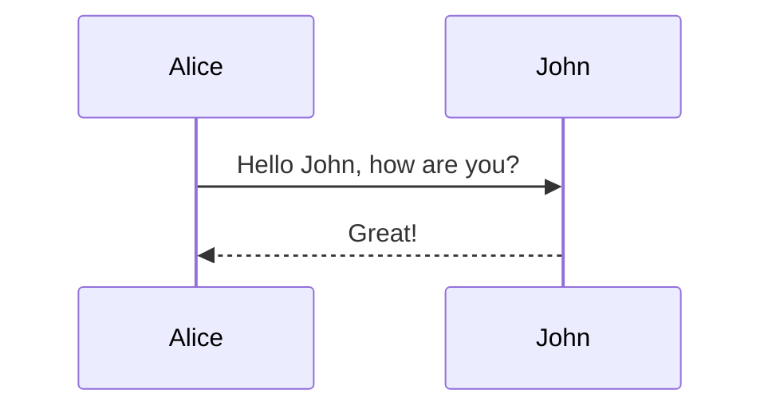

# Ducumentation

Github: [<i class="fas fa-link"></i> Renovamen/renovamen.github.io](https://github.com/Renovamen/renovamen.github.io){:target="_blank"}

Derived from [Huxpro/huxpro.github.io](https://github.com/Huxpro/huxpro.github.io){:target="_blank"}. Some of the designs and code are borrowed from other themes, including but not limited to [mashirozx/Sakura](https://github.com/mashirozx/Sakura/){:target="_blank"}, [kitian616/jekyll-TeXt-theme](https://github.com/kitian616/jekyll-TeXt-theme){:target="_blank"}, [Fechin/hexo-theme-diaspora](https://github.com/Fechin/hexo-theme-diaspora){:target="_blank"}, [liuzc/LeaveIt](https://github.com/liuzc/LeaveIt){:target="_blank"}, et al.

**Gungnir** is the spear of the god Odin in Norse mythology, made from the wood of the world tree Yggdrasil. It has nothing to do with this theme, but I still use this name.


## Installation

Clone the project from Github:

```bash
git clone https://github.com/Renovamen/renovamen.github.io.git
cd renovamen.github.io
```

To run the theme locally, Ruby and Jekyll should be installed firstly, refer to [here](https://jekyllrb.com/docs/installation/){:target="_blank"} for details. Then you could install the dependencies:

```bash
bundle install
```

Then you could start the development server and preview the blog by:

```bash
bundle exec jekyll serve --watch
```

To modify the theme, you may need to install [Grunt](https://gruntjs.com/){:target="_blank"}:

```bash
npm install
```

Then:

```bash
npm run dev
```

## Configuration

All the following options should be configured in `_config.yml`.
{:.info}


### Site Settings
```yaml
title: Renovamen # title of your site
SEOTitle: Renovamen's blog # SEO title of your site
description: Hmm, interesting blog. # description of your site
keyword: "blog, personal website" # keywords of your site
url: "https://renovamen.ink" # URL of your site
baseurl: "" # Base URL of your site. If you site is hosted on 'https://renovamen.ink/blog', it should be '/blog'
avatar: "img/header-avatar.jpeg" # path of the avatar showing on home page
```

### Theme Style
```yaml
theme_style: 
  highlight:  # highlight theme
  alert:  # style of alerts
  post_preview: # style of the post list showing on home page
```

#### Highlight Theme

The default highlight theme looks like this:

```python
import food

class Dragon:
    def __init__(self, happiness):
        self.happiness = happiness
    def code(self):
        """ just code """
        self.happiness -= 60
    def eat(self, n)
        # just eat
        self.happiness += n * food.size

me = Dragon(100)

while True:
    me.code()
    me.eat(10)
```

[Tomorrow](https://github.com/chriskempson/tomorrow-theme){:target="_blank"} can also be chosen as highlight theme:

| `default` | `night` | `night-bright` | `night-eighties` | `night-blue` |
| :--: | :--: | :--: | :--: | :--: |
|  |  |  |  |  |

The default theme is `default`, you can also specify other themes:
```yaml
highlight: # "default" (default), "tomorrow-light", "tomorrow-night", "tomorrow-night-eighties", "tomorrow-night-blue", "tomorrow-night-bright"
```

#### Alert

Showing alerts in articles is supported, refer to [here](#alert-1) for more information about the usages. You can specify the style of alerts:

```yaml
alert:  # "flat" (default), "modern"
```

The default style is `flat`, like [this](#configuration). `modern` style alerts look like this：


#### Post List

`image` (default) means showing featured image of each article on home page, while `text` means showing text only:

```yaml
post_preview: # "image" (default), "text"
```

`image`：


`text`：


### Social Network

```yaml
sns:
  github_username: # Github
  weibo_username: # Weibo
  zhihu_username: # Zhihu
  twitter_username: # Twitter
  facebook_username: # Facebook
  linkedin_username:  # Linkedin
  email_address: # Email Address
```

Links of your social networks will be shown on home page and about page.


### Navigation

Configuration of the first level menu is like this:

```yaml
menus:
  - title: Home
    font: fab fa-fort-awesome
    url: /
  - title: Archive
    font: fas fa-archive
    url: /archive/
```

You should specify the name, URL and icon of each page. [Font Awesome](https://fontawesome.com){:target="_blank"} is used as icon set, you can search for icons [here](https://fontawesome.com/icons){:target="_blank"}.

Use key `submenus` to add the second level menu:

```yaml
menus:
  - title: About
    font: fas fa-paw
    submenus:
      - title: Me
        font: fas fa-user-astronaut
        url: /about/
      - title: Theme
        font: fas fa-meteor
        url: /theme/
```


### Comment

```yaml
comment: 
  provider: # false (default), "disqus", "gitalk", "valine"
```

Disqus, Gitalk and Valine are supported as third party comment systems. You should specify the name of your prefer comment system or use `false` to disable comments. 


#### Disqus

Apply for a *shortname* on [Disqus](https://disqus.com/){:target="_blank"}, then:

```yaml
comment: 
  provider: disqus
  disqus_username: # Disqus shortname
```


#### Gitalk

Register a [Github Application](https://github.com/settings/applications/new) and get the Client ID and Client Secret, then:

```yaml
comment: 
  provider: gitalk
  gitalk:
    clientID: # Github Application Client ID
    clientSecret: # Github Application Client Secret
    repo: # Github repo for storing comments
    owner: # owners of the above mentioned repo
    admin: 
      - admin1
      - admin2
      - ...
```

Refer to the [documentation of Gitalk](https://github.com/gitalk/gitalk){:target="_blank"} for more information.


#### Valine

Create a new application on [Leancloud](https://leancloud.cn/) and get the APP ID and APP Key, then:

```yaml
comment: 
  provider: valine
  valine:
    appID: # LeanCloud App ID
    appKey: # LeanCloud App Key
```

Refer to the [documentation of Valine](https://valine.js.org/){:target="_blank"} for more information.


### Analytics

Google Analytics and Baidu Tongji are supported as the site analytics tools.

#### Baidu Tongji

Paste the code offered by [Baidu Tongji](https://tongji.baidu.com/web/welcome/login){:target="_blank"} here:

```yaml
analytics:
  ba_track_id: # your tracking code
```


#### Google Analytics

Paste the code offered by [Google Analytics](https://tongji.baidu.com/web/welcome/login){:target="_blank"} here:

```yaml
analytics:
  google:
    ga_track_id: 'UA-146858305-1' # your tracking code, format: UA-xxxxxx-xx
    ga_domain: renovamen.ink # URL of your site
```


### CDN

```yaml
cdn: # "jsdelivr" (default), "bootcdn", "unpkg", "cdnjs"
```

[jsDelivr](https://www.jsdelivr.com/){:target="_blank"} is used as the default CDN provider. You can also choose [BootCDN](https://www.bootcdn.cn/){:target="_blank"}, [unpkg](https://unpkg.com/){:target="_blank"} or [cdnjs](https://cdnjs.com/){:target="_blank"} to be your CDN provider. All CDN URLs can be found in `_data/cdn.yml`.


### Additional Functions for Markdown

```yaml
math: 
    enable: # if to enable math rendering for all articles
            # false (default), true
    engine: # specify the math rendering engine
            # "katex" (default), "mathjax"
chart: # if to enable Chart.js: false (defaule), true
mermaid: # if to enable mermaid: false (default), true
emoji-plus: # if to enable additional emoji: false (default), true
```

Refer to [here](#additional-functions-for-markdown-1) for more information.


### Hitokoto

```yaml
hitokoto: true # default: false
```

Set `hitokoto` to `true` to enable the Hitokoto bubble on home page. The bubble will appear when you hover your mouse cursor over the avatar:


## Page

### Home

Switching among multiple cover images is supported. The path and the RGB value of the mask of each cover image should be specified in the Front-matter of `index.html`:

```yaml
description: # the sentence you want to show on the home page
header-img:
    -   url: # path of the cover image1
        mask: # RGB value of the mask of the cover image1 (optional), like: rgba(40, 57, 101, .4)
    -   url: # path of the cover image2
        mask: # RGB value of the mask of the cover image2 (optional)
```

The *mask* is the translucent overlay placed on the cover image. It will be helpful when your cover image is so complex that your title can not stand out.


### About

Just refer to the [About page](/about){:target="_blank"} and its [Front-matter](https://github.com/Renovamen/renovamen.github.io/blob/master/about.html){:target="_blank"} of this site.


### Links

Just refer to the [Links page](/links){:target="_blank"} and its [Front-matter](https://github.com/Renovamen/renovamen.github.io/blob/master/links.html){:target="_blank"} of this site. (Repeat *1)

If any of the links' avatar is not specified, `img/links/default.jpg` will be shown as the default avatar.

If you want to enable comments in this page, you should enable comments in `_config.yml` and set `comment: true` in the Front-matter of this page.


## Content


### Post

Create your posts (Markdown files) under `_posts/` directory. The format of their filename should be `year-month-day-title.md`. Their YAML Front-matter should be like this：

```yaml
---
layout: post
title: # title
subtitle: # subtitle
author: # author's name, defaults to the site's title
header-img: # path of the cover image
header-mask: # RGB value of the mask of the cover image, like: rgba(40, 57, 101, .4)
header-style: text # add this line if you don't want a cover image
catalog: # if to enable catalog: false (default), true
math: # if to enable math rendering
tags: # tags
  - tag1
  - tag2
  - ...
---
```

It should be noted that, `header-img` will be shown on both [home page](#post-list) and post page. Refer to [here](#math-rendering) for the information about the configuration of `math`.


### Additional Functions for Markdown

#### Math Rendering

[Mathjax](https://github.com/mathjax/MathJax){:target="_blank"} and [Katex](https://github.com/KaTeX/KaTeX){:target="_blank"} are supported for rendering mathematical formulas in articles.

Katex is faster than Mathjax (check it out [here](https://katex.org/){:target="_blank"}), but the number of Tex functions it supports is less than Mathjax ([here](https://katex.org/docs/supported.html){:target="_blank"} is all functions supported by Katex).

Math rendering will only be enabled for the articles with `math: true` in their Front-matter when `math.enable: false` is set in `_config.yml`:

```markdown
---
layout: post
math: true
---
```

Otherwise, this function will be enabled for all articles (including `post` and `keynote`).


Example：

Inline math: $$ E = mc^2 $$

Display math:

$$
i\hbar\frac{\partial \psi}{\partial t} = \frac{-\hbar^2}{2m} ( \frac{\partial^2}{\partial x^2} + \frac{\partial^2}{\partial y^2} + \frac{\partial^2}{\partial z^2} ) \psi + V \psi.
$$


```latex
$$ E = mc^2 $$

$$
i \hbar \frac{\partial \psi}{\partial t}
= \frac{-\hbar^2}{2m} ( \frac{\partial^2}{\partial x^2} + \frac{\partial^2}{\partial y^2} + \frac{\partial^2}{\partial z^2} ) \psi + V \psi
$$
```


#### Chart and Diagram

##### Chart (Chart.js)

[Chart.js](https://github.com/chartjs/Chart.js){:target="_blank"} is used to create interactive charts in articles. Refer to the [documentation of Chart.js](https://www.chartjs.org/docs/latest/){:target="_blank"} for the methods of creating charts.

Example：

```chart
{
    "type": "bar",
    "data": {
        "labels": ["Red", "Blue", "Yellow", "Green", "Purple", "Orange"],
        "datasets": [{
            "label": "# of Votes",
            "data": [12, 19, 3, 5, 2, 3],
            "backgroundColor": [
                "rgba(255, 99, 132, 0.2)",
                "rgba(54, 162, 235, 0.2)",
                "rgba(255, 206, 86, 0.2)",
                "rgba(75, 192, 192, 0.2)",
                "rgba(153, 102, 255, 0.2)",
                "rgba(255, 159, 64, 0.2)"
            ],
            "borderColor": [
                "rgba(255, 99, 132, 1)",
                "rgba(54, 162, 235, 1)",
                "rgba(255, 206, 86, 1)",
                "rgba(75, 192, 192, 1)",
                "rgba(153, 102, 255, 1)",
                "rgba(255, 159, 64, 1)"
            ],
            "borderWidth": 1
        }]
    },
    "options": {
        "scales": {
            "yAxes": [{
                "ticks": {
                    "beginAtZero": true
                }
            }]
        }
    }
}
```


    ```chart
    {
        "type": "bar",
        "data": {
            "labels": ["Red", "Blue", "Yellow", "Green", "Purple", "Orange"],
            "datasets": [{
                "label": "# of Votes",
                "data": [12, 19, 3, 5, 2, 3],
                "backgroundColor": [
                    "rgba(255, 99, 132, 0.2)",
                    "rgba(54, 162, 235, 0.2)",
                    "rgba(255, 206, 86, 0.2)",
                    "rgba(75, 192, 192, 0.2)",
                    "rgba(153, 102, 255, 0.2)",
                    "rgba(255, 159, 64, 0.2)"
                ],
                "borderColor": [
                    "rgba(255, 99, 132, 1)",
                    "rgba(54, 162, 235, 1)",
                    "rgba(255, 206, 86, 1)",
                    "rgba(75, 192, 192, 1)",
                    "rgba(153, 102, 255, 1)",
                    "rgba(255, 159, 64, 1)"
                ],
                "borderWidth": 1
            }]
        },
        "options": {
            "scales": {
                "yAxes": [{
                    "ticks": {
                        "beginAtZero": true
                    }
                }]
            }
        }
    }
    ```

`Note`{:.warning}：the `key` in `json` should be with **quotes**, or there will be some unexpected errors...


##### Diagram (mermaid)

[mermaid](https://github.com/knsv/mermaid){:target="_blank"} is used to create diagrams in articles. Refer to the [documentation of mermaid](https://mermaid-js.github.io/mermaid/){:target="_blank"} for the methods of creating diagrams.

Example：



    ```mermaid
    sequenceDiagram
        Alice->>John: Hello John, how are you?
        John-->>Alice: Great!
    ```


#### Tag
`info`{:.info}

```markdown
`info`{:.info}
```

`success`{:.success}

```markdown
`success`{:.success}
```

`warning`{:.warning}

```markdown
`warning`{:.warning}
```

`error`{:.error}

```markdown
`error`{:.error}
```


#### Alert
A info alert.
{:.info}

```markdown
A info alert.
{:.info}
```

A success alert.
{:.success}

```markdown
A success alert.
{:.success}
```

A warning alert.
{:.warning}

```markdown
A warning alert.
{:.warning}
```

An error alert.
{:.error}

```markdown
An error alert.
{:.error}
```


#### Emoji

[jemoji](https://github.com/jekyll/jemoji){:target="_blank"} is used to generate emojis. This plugin should be installed manually:

```bash
gem install jemoji
```

[Here](https://pages.github.com/versions/){:target="_blank"} we can know that jemoji has already been installed on Github Pages. Code of all emojis can be found [here](https://www.webfx.com/tools/emoji-cheat-sheet/){:target="_blank"}.


Example:

:smile: :smirk: :racehorse: :wolf:

```markdown
:smile: :smirk: :racehorse: :wolf:
```


#### Image Annotation


This is an image.
{:.desc}

    

    This is an image.
    {:.desc}


## Libraries

### CSS

- [Bootstrap](https://github.com/twbs/bootstrap){:target="_blank"}
- [Font Awesome](https://github.com/FortAwesome/Font-Awesome){:target="_blank"}
- [Font Awesome Animation](https://github.com/l-lin/font-awesome-animation){:target="_blank"} (animation of icons)

### JavaScript
- [jQuery](https://github.com/jquery/jquery){:target="_blank"}
- [ScrollReveal](https://github.com/jlmakes/scrollreveal){:target="_blank"} (enter animation of the post list (home page) and timeline (about page))
- [Tocbot](https://github.com/tscanlin/tocbot){:target="_blank"} (catalog of articles)
- [AnchorJS](https://github.com/bryanbraun/anchorjs/){:target="_blank"} (anchors of articles)
- [Gitalk](https://github.com/gitalk/gitalk){:target="_blank"}
- [Valine](https://github.com/xCss/Valine){:target="_blank"}
- [Chart.js](https://github.com/chartjs/Chart.js){:target="_blank"} ([charts](#chart-chartjs))
- [mermaid](https://github.com/mermaid-js/mermaid){:target="_blank"} ([diagrams](#diagram-mermaid))
- [MathJax](https://github.com/mathjax/MathJax){:target="_blank"} (math rendering)
- [Katex](https://github.com/KaTeX/KaTeX){:target="_blank"} (math rendering)
- [Simple-Jekyll-Search](https://github.com/christian-fei/Simple-Jekyll-Search){:target="_blank"} (search)
- [fastclick](https://github.com/ftlabs/fastclick){:target="_blank"} (remove click delays on mobile browsers)
- [LazyLoad](https://github.com/rgrove/lazyload){:target="_blank"} (lazyload JavaScript and CSS files)