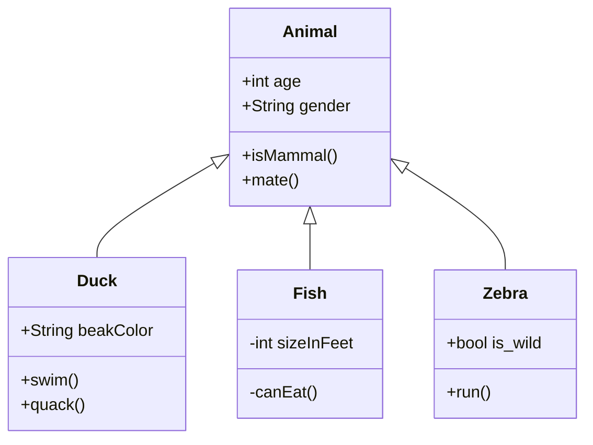

# 这大概是一篇（施工中的）文档

Github: [<i class="fa fa-link"></i> Renovamen/renovamen.github.io](https://github.com/Renovamen/renovamen.github.io){:target="_blank"}

在 [Huxpro/huxpro.github.io](https://github.com/Huxpro/huxpro.github.io){:target="_blank"} 的基础上瞎改的的主题，同时~~照搬~~借鉴了很多其他主题的代码和设计，包括但不限于 [mashirozx/Sakura](https://github.com/mashirozx/Sakura/){:target="_blank"}、[kitian616/jekyll-TeXt-theme](https://github.com/kitian616/jekyll-TeXt-theme){:target="_blank"}、[Fechin/hexo-theme-diaspora](https://github.com/Fechin/hexo-theme-diaspora){:target="_blank"}、[liuzc/LeaveIt](https://github.com/liuzc/LeaveIt){:target="_blank"} 等（这么看来似乎也没多少东西是我自己写的了，逃）。

**Gungnir**，冈格尼尔，北欧神话中主神奥丁使用的用世界树树枝做成的武器，和本主题并没有什么关系但我就是用了这个名字。

## 快速开始
```bash
git clone https://github.com/Renovamen/renovamen.github.io.git
jekyll serve # 本地预览
```

## 配置
以下配置都在 `_config.yml` 中进行。
{:.info}


### 网站配置
```yaml
title: Renovamen # 标题
SEOTitle: Renovamen's blog # SEO 标题
description: Hmm, interesting blog. # 描述
keyword: "blog, personal website" # 关键词
url: "https://renovamen.ink" # 域名
baseurl: "" # 根路径。比如网站地址为 'https://renovamen.ink/blog'，则该项应为 '/blog'
avatar: "img/header-avatar.jpeg" # 首页头像路径
```

### 主题风格
```yaml
theme_style: 
  highlight:  # 代码高亮主题
  alert:  # 提示风格
  post_preview: # 首页文章列表显示风格
```

#### 代码高亮
使用了 [Tomorrow](https://github.com/chriskempson/tomorrow-theme){:target="_blank"} 作为代码高亮主题：


| `default` | `night` | `night-bright` | `night-eighties` | `night-blue` |
| :--: | :--: | :--: | :--: | :--: |
|  |  |  |  |  |

默认主题为 `default`，指定其他主题：
```yaml
highlight: # "default" (default), "night", "night-eighties", "night-blue", "night-bright"
```

#### 提示
支持在 Markdown 中使用提示样式以呈现一些警告，[这里](#提示-1)是使用方法。指定提示风格：
```yaml
alert:  # "flat" (default), "modern"
```

默认为 `flat`，长[这样](#配置)。`modern` 风格长这样：


#### 首页文章列表

首页文章列表是否显示特征图片，`image` 为显示（默认），`text` 为不显示：

```yaml
post_preview: # "image" (default), "text"
```

`image`：


`text`：


### 社交链接

```yaml
sns:
  github_username: # Github
  weibo_username: # 微博
  zhihu_username: # 知乎
  twitter_username: # 推特  
  facebook_username: # Facebook
  linkedin_username:  # 领英
  email_address: # 邮件地址
```
填入用户名或用户 ID 后，社交链接会出现在页面下方和 About 页中。


### 导航菜单

一级菜单的配置如下：

```yaml
menus:
  - title: Home
    font: fa-fort-awesome
    url: /
  - title: Archive
    font: fa-archive
    url: /archive/
```

需要填入每个页面的名称、路径和图标。图标库使用了 [Font Awesome](https://fontawesome.com){:target="_blank"}，可以在[这里](https://fontawesome.com/icons?d=gallery){:target="_blank"}查找图标。

如果要添加**二级菜单**，则需要在需要添加二级菜单的一级菜单下添加 `submenu` 关键字，然后在 `submenu` 下填入每个二级菜单页面的名称、路径和图标：

```yaml
menus:
  - title: About
    font: fa-paw
    submenus:
      - title: Me
        font: fa-grav
        url: /about/
      - title: Theme
        font: fa-wpexplorer
        url: /theme/
```

### 评论

```yaml
comment: 
  provider: # false (default), "disqus", "gitalk", "valine"
```

支持三种评论系统：Disqus、Gitalk 和 Valine。需要在 `provider` 中填入想要启用的评论系统的名字，如果不想用启用评论就填 `false` 或不填。

#### Disqus

在 [Disqus](https://disqus.com/){:target="_blank"} 申请一个自己网站的 Disqus，然后把 shortname 填入 `disqus_username`：

```yaml
comment: 
  provider: disqus
  disqus_username: # Disqus shortname
```

#### Gitalk

注册一个 [Github Application](https://github.com/settings/applications/new){:target="_blank"} 并搞到 Client ID 和 Client Secret，然后填入对应信息：

```yaml
comment: 
  provider: gitalk
  gitalk:
    clientID: # Github Application Client ID
    clientSecret: # Github Application Client Secret
    repo: # 用来放评论的 Github 仓库
    owner: # 上述 Github 仓库的拥有者 ID
    admin: 
      - 管理员1
      - 管理员2
      - ...
```

可以参考 [Gitalk 文档](https://github.com/gitalk/gitalk){:target="_blank"}。

#### Valine

按照 [Valine 文档](https://valine.js.org/){:target="_blank"} 在 [LeanCloud](https://www.leancloud.cn/){:target="_blank"} 注册应用，然后填入 App ID 和 App Key：

```yaml
comment: 
  provider: valine
  valine:
    appID: # LeanCloud App ID
    appKey: # LeanCloud App Key
```

### 分析统计

支持谷歌统计和百度统计。

#### 百度统计

搞到[百度统计](https://tongji.baidu.com/web/welcome/login){:target="_blank"}的统计代码并填入对应位置：

```yaml
analytics:
  ba_track_id: # 百度统计代码
```

#### 谷歌统计

搞到[谷歌统计](https://www.google.com/analytics/){:target="_blank"}的跟踪 ID 并填入对应位置：

```yaml
analytics:
  google:
    ga_track_id: 'UA-146858305-1' # 谷歌统计跟踪 ID，格式：UA-xxxxxx-xx
    ga_domain: renovamen.ink # 要跟踪的网站域名
```


### 一言

```yaml
hitokoto: true # default: false
```

将 `hitokoto` 设为 `true` 可以开启首页的一言气泡，将鼠标悬浮在头像上气泡就会显示出来：


## 页面

### 首页

```yaml
description: # 想在首页显示的一句话
header-img:
    -   url: # 首页封面图路径1
        mask: # 封面图1的遮罩（可选），格式：rgba(40, 57, 101, .4)
    -   url: # 首页封面图路径2
        mask: # 封面图1的遮罩（可选）
```

在首页点击封面图左右两边的按钮可以在多图片之间进行切换。需要按上述格式在 `header-img` 下填入每张封面图的路径和遮罩的 RGB 数值（可选）。遮罩是指在封面图上盖一层半透明的颜色，如果图片比较复杂导致文字显示得不够清楚，可以考虑加个遮罩。


### About

参考一下本站 [About 页面](/about){:target="_blank"} 和它的 [Front-matter](https://github.com/Renovamen/renovamen.github.io/blob/master/about.html){:target="_blank"} 大概就知道怎么改了？


### Links

参考一下本站 [Links 页面](/links){:target="_blank"} 和它的 [Front-matter](https://github.com/Renovamen/renovamen.github.io/blob/master/links.html){:target="_blank"} 大概就知道怎么改了？


### Portfolio

参考一下本站 [Portfolio 页面](/portfolio){:target="_blank"} 和它的 [Front-matter](https://github.com/Renovamen/renovamen.github.io/blob/master/portfolio.html){:target="_blank"} 大概就知道怎么改了？


### 甩锅

感觉写得像个复读机...

或者你想重写上述三个页面的话，改 `_layouts/` 和 `_sassl/layouts/` 文件夹里对应文件的代码就行。


## 内容

### Markdown 附加功能

#### Mathjax

使用了 [Mathjax](https://github.com/mathjax/MathJax){:target="_blank"} 以在 Markdown 中渲染数学公式。

如果 `_config.yml` 中 `mathjax: true`，则所有文章（包括 Post 和 Keynote）中都会开启公式渲染。否则只有 Front-matter 中添加了 `mathjax: true` 的文章才会开启此功能：

```markdown
---
layout: post
mathjax: true
---
```

示例：

$$
i\hbar\frac{\partial \psi}{\partial t} = \frac{-\hbar^2}{2m} ( \frac{\partial^2}{\partial x^2} + \frac{\partial^2}{\partial y^2} + \frac{\partial^2}{\partial z^2} ) \psi + V \psi.
$$


```latex
$$
i \hbar \frac{\partial \psi}{\partial t}
= \frac{-\hbar^2}{2m} ( \frac{\partial^2}{\partial x^2} + \frac{\partial^2}{\partial y^2} + \frac{\partial^2}{\partial z^2} ) \psi + V \psi
$$
```

#### 图表

##### Chart.js

使用了 [Chart.js](https://github.com/chartjs/Chart.js){:target="_blank"} 以在 Markdown 中加入可交互的图表。可以参考 [Chart.js 文档](https://www.chartjs.org/docs/latest/){:target="_blank"}来创建表格。

示例：


```chart
{
    "type": "bar",
    "data": {
        "labels": ["Red", "Blue", "Yellow", "Green", "Purple", "Orange"],
        "datasets": [{
            "label": "# of Votes",
            "data": [12, 19, 3, 5, 2, 3],
            "backgroundColor": [
                "rgba(255, 99, 132, 0.2)",
                "rgba(54, 162, 235, 0.2)",
                "rgba(255, 206, 86, 0.2)",
                "rgba(75, 192, 192, 0.2)",
                "rgba(153, 102, 255, 0.2)",
                "rgba(255, 159, 64, 0.2)"
            ],
            "borderColor": [
                "rgba(255, 99, 132, 1)",
                "rgba(54, 162, 235, 1)",
                "rgba(255, 206, 86, 1)",
                "rgba(75, 192, 192, 1)",
                "rgba(153, 102, 255, 1)",
                "rgba(255, 159, 64, 1)"
            ],
            "borderWidth": 1
        }]
    },
    "options": {
        "scales": {
            "yAxes": [{
                "ticks": {
                    "beginAtZero": true
                }
            }]
        }
    }
}
```


    ```chart
    {
        "type": "bar",
        "data": {
            "labels": ["Red", "Blue", "Yellow", "Green", "Purple", "Orange"],
            "datasets": [{
                "label": "# of Votes",
                "data": [12, 19, 3, 5, 2, 3],
                "backgroundColor": [
                    "rgba(255, 99, 132, 0.2)",
                    "rgba(54, 162, 235, 0.2)",
                    "rgba(255, 206, 86, 0.2)",
                    "rgba(75, 192, 192, 0.2)",
                    "rgba(153, 102, 255, 0.2)",
                    "rgba(255, 159, 64, 0.2)"
                ],
                "borderColor": [
                    "rgba(255, 99, 132, 1)",
                    "rgba(54, 162, 235, 1)",
                    "rgba(255, 206, 86, 1)",
                    "rgba(75, 192, 192, 1)",
                    "rgba(153, 102, 255, 1)",
                    "rgba(255, 159, 64, 1)"
                ],
                "borderWidth": 1
            }]
        },
        "options": {
            "scales": {
                "yAxes": [{
                    "ticks": {
                        "beginAtZero": true
                    }
                }]
            }
        }
    }
    ```

`注意`{:.warning}：`json` 中的 `key` 值一定要加引号，否则会渲染出错。


##### mermaid

使用了 [mermaid](https://github.com/knsv/mermaid){:target="_blank"} 以在 Markdown 中加入流程图、状态图、时序图、甘特图等。可以参考 [mermaid 文档](https://mermaid-js.github.io/mermaid/){:target="_blank"}来创建图。

示例：



    ```mermaid
    classDiagram
        Animal <|-- Duck
        Animal <|-- Fish
        Animal <|-- Zebra
        Animal : +int age
        Animal : +String gender
        Animal: +isMammal()
        Animal: +mate()
        class Duck{
            +String beakColor
            +swim()
            +quack()
        }
        class Fish{
            -int sizeInFeet
            -canEat()
        }
        class Zebra{
            +bool is_wild
            +run()
        }
    ```


#### 标签

`消息标签`{:.info}

```markdown
`消息标签`{:.info}
```

`成功标签`{:.success}

```markdown
`成功标签`{:.success}
```

`警告标签`{:.warning}

```markdown
`警告标签`{:.warning}
```

`错误标签`{:.error}

```markdown
`错误标签`{:.error}
```

#### 提示

消息提示文案
{:.info}

```markdown
消息提示文案
{:.info}
```

成功提示文案
{:.success}

```markdown
成功提示文案
{:.success}
```

警告提示文案
{:.warning}

```markdown
警告提示文案
{:.warning}
```

错误提示文案
{:.error}

```markdown
错误提示文案
{:.error}
```

#### 图片注释


这是一张图片
{:.desc}

    这是一张图片
    {:.desc}


## 用到的开源库

### CSS

- [Bootstrap](https://github.com/twbs/bootstrap){:target="_blank"}
- [Font Awesome](https://github.com/FortAwesome/Font-Awesome){:target="_blank"}
- [Font Awesome Animation](https://github.com/l-lin/font-awesome-animation){:target="_blank"}（图标动画）
- [Animate.css](https://github.com/daneden/animate.css){:target="_blank"}（animatedModal.js 的依赖库）

### JavaScript
- [jQuery](https://github.com/jquery/jquery){:target="_blank"}
- [ScrollReveal](https://github.com/jlmakes/scrollreveal){:target="_blank"}（图片模式下文章列表上浮效果，About 页面的时间轴上浮效果）
- [Tocbot](https://github.com/tscanlin/tocbot){:target="_blank"}（文章目录）
- [AnchorJS](https://github.com/bryanbraun/anchorjs/){:target="_blank"}（文章锚点）
- [Gitalk](https://github.com/gitalk/gitalk){:target="_blank"}（Gitalk 评论）
- [Valine](https://github.com/xCss/Valine){:target="_blank"}（Valine 评论）
- [Chart.js](https://github.com/chartjs/Chart.js){:target="_blank"}（[图表](#chartjs)）
- [mermaid](https://github.com/mermaid-js/mermaid){:target="_blank"}（[图表](#mermaid)）
- [MathJax](https://github.com/mathjax/MathJax){:target="_blank"}（公式渲染）
- [Sweet Scroll](https://github.com/wadackel/sweet-scroll){:target="_blank"}（首页和 About 页点击向下箭头后页面的平滑滚动效果）
- [Simple-Jekyll-Search](https://github.com/christian-fei/Simple-Jekyll-Search){:target="_blank"}（搜索）
- [fastclick](https://github.com/ftlabs/fastclick){:target="_blank"}（解决移动设备上的点击延迟问题）
- [animatedModal.js](https://github.com/joaopereirawd/animatedModal.js){:target="_blank"}（搜索页面弹出动画）
- [LazyLoad](https://github.com/rgrove/lazyload){:target="_blank"}（JavaScript 和 CSS 文件延迟加载）