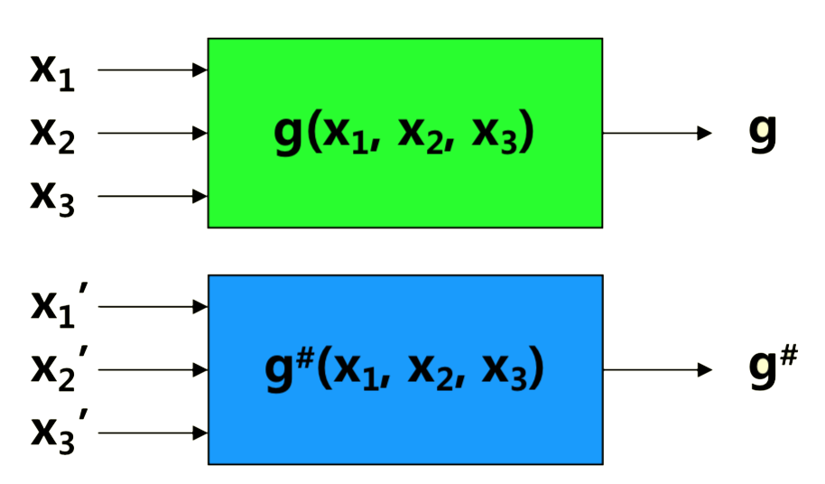
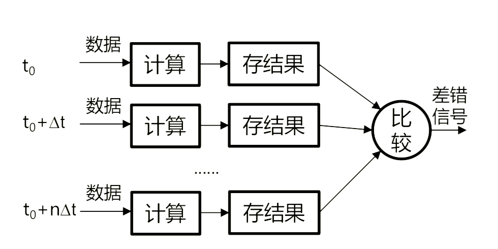
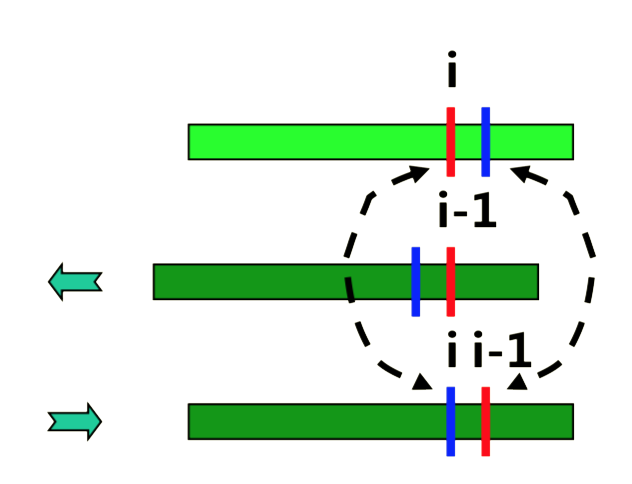
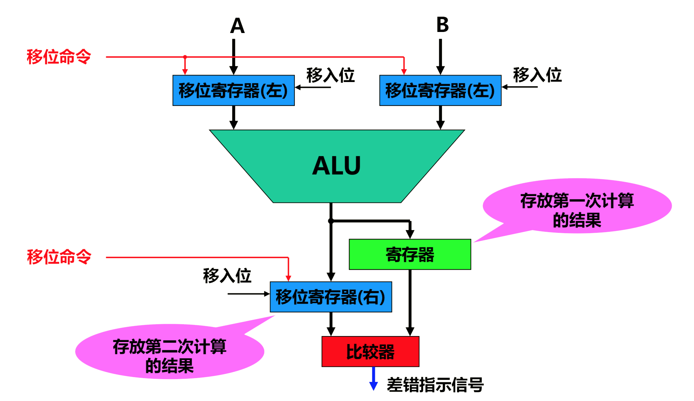
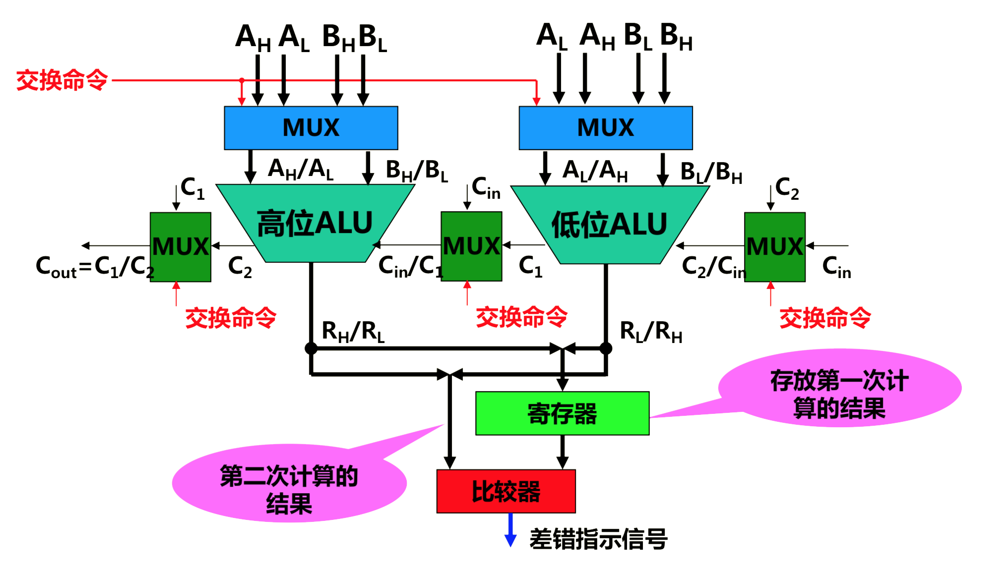
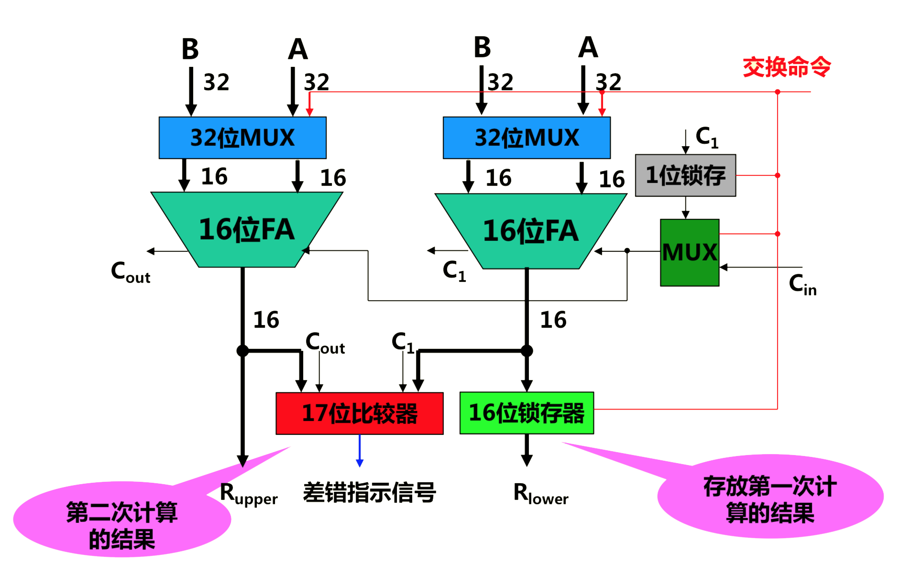
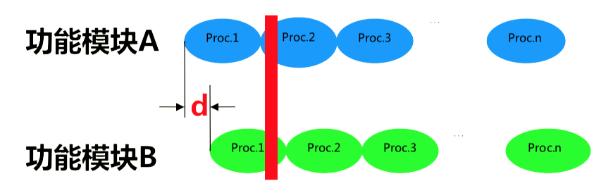
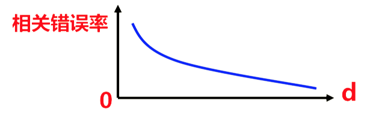

# 7. 差错检测

## 7.1 测试与故障诊断

测试：检测系统是否符合设计要求或能否正常工作

数字系统测试：功能、时序关系、逻辑关系

故障检测（Fault Detection）：仅检查一个系统是否存在故障

故障诊断（Fault Diagnosis）：检查一个系统是否存在故障，并确定故障的位置

- 有时可能还需要确定故障的其他属性，如故障类型
- 测试时故障检测和故障诊断的基本手段

分类：

- 在线测试：系统在正常工作的同时进行测试
- 离线测试：系统脱离正常工作条件，在特定测试装置上进行测试

## 7.2 双模比较冗余测试

两个相同模块通过一个比较器进行并联，若有一个模块出错，则比较器报错

基于以下假设：

- 两个模块同时出错概率非常低
  - 同一时刻，一个模块出错引起另一个模块出错的概率非常低
  - 同一时刻，在同一干扰作用下的两个模块产生相同错误的概率非常低
- 比较器可靠性很高

问题：

- 两个假设在一些环境下难以满足
- 普通检测器无法检测出共模错误（Common-mode Fault）（两个功能模块A, B的输出信号($a_0, a_0 ... a_n $)和($b_0, b_0 ... b_n $)在同一位($a_i$和$b_i$)同时发生相同的错误）

## 7.3 互补逻辑

在双模比较冗余结构上，要求两个冗余模块所实现的函数是对偶的：一个以正逻辑运行，另一个以负逻辑运行。输入也以正、负逻辑形式分别加到两个模块上。

例：

原函数：$g(x_1, x_2, x_3) = x_1x_2x_3' + x_1'x_2'x_3$

补函数：$g’(x_1, x_2, x_3)=(x_1’+x_2’+x_3)(x_1+x_2+x_3’) $

对偶函数：$g^ \sharp(x_1, x_2, x_3)=(x_1+x_2+x_3’)(x_1’+x_2’+x_3)$

原函数的输入： $ (x_1, x_2, x_3)=(1, 1, 1) $

对偶函数的输入：$ (x_1’, x_2’, x_3’)=(0, 0, 0) $

$∴ g^\sharp=g’ $

优点：

- 对偶实现要求用不同的设计和制造技术来制作两个冗余模块，共模失效的可能性降低

- 两个模块中相应信号线上的电信号传输方向相反，那些对电信号传输很敏感的故障产生相同效应的可能性将会减小

- 正常情况下两个模块中相应信号线上的电平值总不相同，因此它们的短路将导致其电平值趋于相同，依然可
  以检测

## 7.4 重复计算

### 7.4.1 重复计算检测瞬时故障

相同的计算重复进行两次或多次，并比较计算结果以检测是否有差错。若检测到差错，则可再计算一次，以消除瞬时故障的影响，达到恢复的目的

重复计算对永久性故障没有效果

改进：减小重复计算的次数

- 计算模块采用差错检测码
- 检错过程只需计算一次。 

### 7.4.2 重复计算检测永久故障

要求编码函数$e(X)$能够检测硬件的永久性故障。 

编码函数的实现：

- 交替逻辑 
- 移位重算 
- 交换重算 
- 双模比较重算 

#### 7.4.2.1 移位重算ALU（RESO）

设ALU是位片实现的，第i个位片出现故障

逻辑运算：

- 第一次计算结果的第i位出现差错
- 左移一位(因为是逻辑运算，所以故障只影响第i个位片)
- 第二次计算结果的第i-1位出现差错
- 右移第二次计算的结果一位
- 比较：结果的第i位与第i-1位出现不一致

• 算术运算(以加法为例)

- 第一次计算结果的第i位(和第i+1位)出现差错
- 左移两位(因为有进位，故障可能影响第i位与第i+1位)
- 第二次计算结果的第i-2位(和第i-1位)出现差错
- 右移第二次计算的结果两位
- 比较：结果的第i位与第i-2位(和第i+1位与i-1位)出现不一致

结构：

缺点：

- 需增设硬件（如3个移位寄存器，1个寄存器）

- 不能覆盖移位寄存器的故障

- 要求比较器能检测自身故障

#### 7.4.2.2 交换重算（RESWO）

过程：

- 第一次计算按数据的原始格式进行：

  $A_H$和$B_H$→高位ALU，	$A_L$和$B_L$→低位ALU

-  第二次计算高位组与低位组交换位置：

  $A_L$和$B_L$→高位ALU，	$A_H$和$B_H$→低位ALU

- 比较两次计算的结果以检测故障 

  - 有故障的位片在两次计算中将影响不同的数据位

  - 算术运算还要考虑数据交换后进位的正确传送（由MUX完成）

能够在纹波进位加法器中检测任何位片故障

结构：

#### 7.4.2.3 双模比较重算（REDWC）

基于硬件冗余和时间冗余原理。 

数据分为高位组和低位组，运算器也分为位数相同的两个组（相当于一个DMR比较结构）。

过程：

- 第一次计算由操作数的低位组参加，按DMR比较方式计算，结果若无差错则予以锁存
- 第二次计算由操作数的高位组参加，也按DMR比较方式计算
- 若第二次计算的结果无差错，则将其与被锁存的低位结果连在一起形成完整的结果，然后输出

双模比较重算全加器结构：

## 7.5 时间相异性

用于比较检测技术的两个完全相同的功能模块A和功能模块B，A的数据处理比B提前时间差d，而且两个功能模块执行Proc.1、Proc.2、...、Proc.n始终保持时间差d。 

当电气干扰串入时，A在执行Proc.2，而B在执行Proc.1，导致两个模块产生不同的错误

相关错误的概率随着时间差d的增加而减少

优点：

- 可以不编写两种版本程序

- 可以将两个模块连同比较器在VLSI电路上实现

- 可以做到总线信号比较或系统级比较

采用异构型双机系统的优点：

- 各机的硬件从使用的芯片到整机结构不一样，使共模故障的概率达到最小
- 由于硬件完全不同，软件系统必须采用多版本设计，从而进一步降低了共模故障概率 

